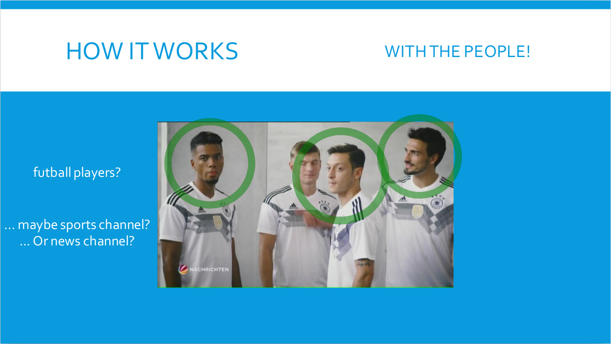
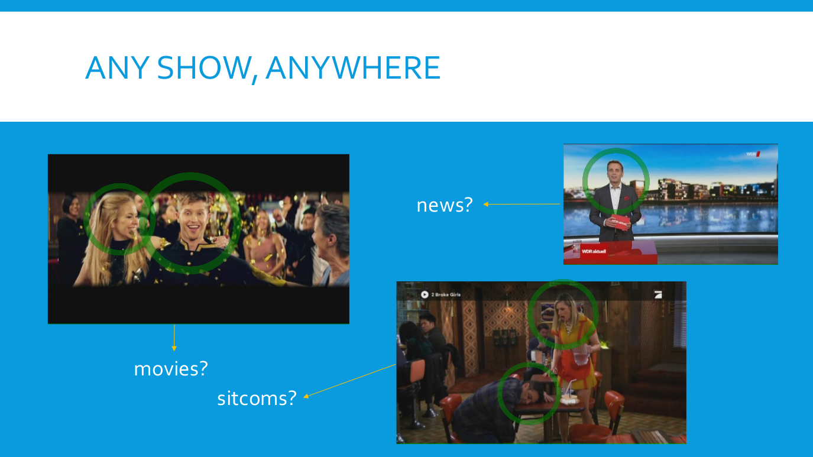
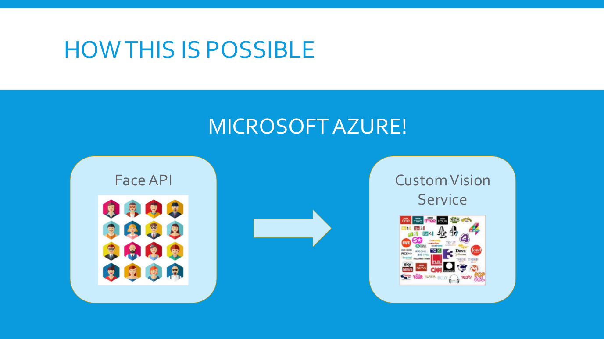

# SmartZapping

## Description

Detect and classify channel logos in different TV screen settings.

Use face recognition and link each face to channel stations. Then, after narrowing the search scope, crop the rectangle of the frame and classify the logo.

<div align="center">
	
</div>

<div align="center">
	
</div>

It uses Microsoft Azure Face API for face recognition. For logo classification, it uses Microsoft Azure Custom Vision Services.

<div align="center">
	
</div>

Feel free to add more training data and keep improving the neural network supporting all of this!

## License
```
Smart Zapping is distributed under the terms of the GNU General
Public License version 2.
```

## Bug Reports
```
Any kind of bug reports are welcome.
If you find a bug in Smart Zapping, please send an email.

                                                 Jose Luis Acevedo
                                     joseluisacevedo1995@gmail.com
                                     	   jose.acevedos@in.tum.de
```